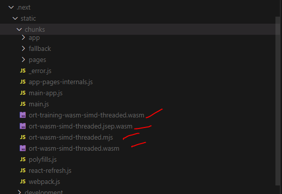
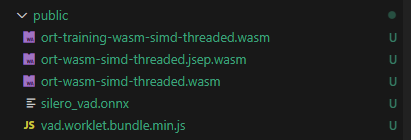

# VAD-Audio-Saver

## Overview

This project utilizes voice activity detection (VAD) using the **`@ricky0123/vad-react`** library along with the **`onnxruntime-web`** package for running ONNX models in the browser. Follow the instructions below to set up and run the project correctly.

## Installation

To install the required packages, run the following commands in your terminal:

```bash
npm install @ricky0123/vad-react @ricky0123/vad-web onnxruntime-web
npm install -D copy-webpack-plugin
```

## Important Files

Manually Copy these four files from Public folder to .next/static/chunks



This file will get copy while npm run dev



## Manual Steps

Make sure to manually copy the necessary files from the `.next/static/chunks` folder as indicated in the uploaded images `chunks.png` and `publis.png`. This step is crucial for the project to function correctly.

## Configuration

In your `next.config.js`, ensure that the configuration allows for the proper handling of static assets and WebAssembly:

```javascript
import fs from 'node:fs/promises'
import path from 'node:path'

/** @type {import('next').NextConfig} */
const nextConfig = {
  async headers() {
    return [
      {
        source: '/(.*)',
        headers: [
          { key: 'Cross-Origin-Opener-Policy', value: 'same-origin' },
          { key: 'Cross-Origin-Embedder-Policy', value: 'require-corp' },
        ],
      },
    ]
  },
  webpack: (config, { isServer }) => {
    if (!isServer) {
      config.resolve.fallback = { ...config.resolve.fallback, fs: false }
    }
    return config
  },
}

export default nextConfig

// File copying logic
async function copyFiles() {
  try {
    await fs.access('public/')
  } catch {
    await fs.mkdir('public/', { recursive: true })
  }

  const wasmFiles = (
    await fs.readdir('node_modules/onnxruntime-web/dist/')
  ).filter((file) => path.extname(file) === '.wasm')

  await Promise.all([
    fs.copyFile(
      'node_modules/@ricky0123/vad-web/dist/vad.worklet.bundle.min.js',
      'public/vad.worklet.bundle.min.js'
    ),
    fs.copyFile(
      'node_modules/@ricky0123/vad-web/dist/silero_vad.onnx',
      'public/silero_vad.onnx'
    ),
    fs.copyFile(
      'node_modules/onnxruntime-web/dist/ort-wasm-simd-threaded.mjs',
      'public/ort-wasm-simd-threaded.mjs'
    ),
    ...wasmFiles.map((file) =>
      fs.copyFile(`node_modules/onnxruntime-web/dist/${file}`, `public/${file}`)
    ),
  ])
}

// Call the function to copy files during build
copyFiles()
```

## Usage

After following the above installation and manual steps, you can start the development server with:

```bash
npm run dev
```

Visit `http://localhost:3000` to see the application in action.
